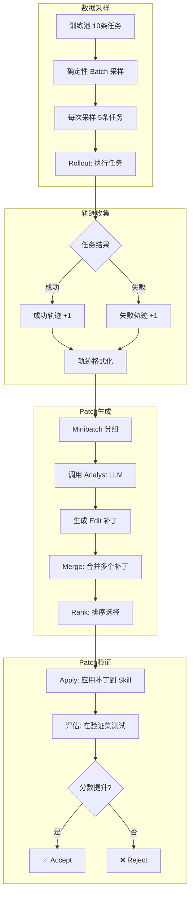

# SpreadsheetBench SkillOpt 训练过程完整技术报告

## 📋 概述

本文档详细记录 SkillOpt 框架的完整训练流程，包括：**数据采样 → 轨迹收集 → Patch 生成 → Patch 验证**的全过程。

### 训练配置
- **模型**: qwen3.6-35b-a3b (DashScope API)
- **API**: https://dashscope.aliyuncs.com/compatible-mode/v1
- **训练数据**: 10 条
- **验证数据**: 3 条
- **迭代轮次**: 3 epochs (共 5 steps)
- **初始 Skill**: `empty_initial.md` (完全空白)

---

## 🔄 完整训练流程



---

## 1️⃣ 数据采样 (Data Sampling)

### 1.1 配置参数

```yaml
# configs/spreadsheetbench/dashscope_qwen36.yaml
train:
  train_size: 10      # 训练池总大小
  batch_size: 5       # 每个 step 采样 5 条
  accumulation: 1     # 不累积，直接一个 batch
  seed: 42            # 随机种子

gradient:
  minibatch_size: 8   # 分析师 minibatch 大小
```

### 1.2 采样流程

```
代码位置: skillopt/datasets/base.py

plan_train_epoch()
  │
  ├─ make_base_seeds(steps_per_epoch=2, accumulation=1, seed=42)
  │     → base_seeds = [43, 44]  # seed + i + 1
  │
  └─ shuffle_epoch_seeds(base_seeds, epoch=1, seed=42)
        → epoch_rng = random.Random(42 + 1*1000) = random.Random(1042)
        → shuffled = [44, 43] 或 [43, 44] (确定性随机)
```

### 1.3 BatchSpec 构建

```python
# build_train_batch() 返回 BatchSpec
BatchSpec(
    phase="train",
    split="train",
    seed=1043,        # 确定性采样 seed
    batch_size=5,
    payload=[item1, item2, item3, item4, item5]  # 5 条任务
)
```

### 1.4 实际采样结果 (Step 1)

```
Rollout 结果 (5条任务全部成功):
├─ test_002: Add a new column Doubled (Cell-Level Manipulation) ✓
├─ test_005: Add a new column Doubled (Cell-Level Manipulation) ✓
├─ test_007: Add a new column Doubled (Cell-Level Manipulation) ✓
├─ test_008: Add a new column Doubled (Cell-Level Manipulation) ✓ (2 turns)
└─ test_010: Add a new column Doubled (Cell-Level Manipulation) ✓
```

---

## 2️⃣ 轨迹收集 (Trajectory Collection)

### 2.1 Rollout 执行

```python
# 代码位置: skillopt/envs/spreadsheetbench/rollout.py

run_spreadsheet_batch_codegen()
  │
  └─ process_one_codegen(item, data_root, out_root, skill_content, ...)
        │
        ├─ 构建 System Prompt (skill + codegen_system)
        ├─ 构建 User Prompt (instruction + preview)
        ├─ 调用 LLM 生成 Python 代码
        ├─ 执行代码: run_generated_code()
        └─ 评估结果: evaluate(pred_path, gold_path, ...)
```

### 2.2 System Prompt (codegen_system)

```
You are an expert Python programmer specializing in spreadsheet manipulation.
You will be given a user instruction together with a preview of an input .xlsx file.
Your job is to write a single self-contained Python script that reads the input file
at the path stored in the variable INPUT_PATH, performs the requested manipulation,
and saves the result to OUTPUT_PATH.

## Skill
{Skill 内容}  ← 这里是空的 empty_initial.md

Return ONLY the Python code inside a single ```python ... ``` fenced block.
```

### 2.3 User Prompt

```
# Instruction
Add a new column Doubled that contains each number in column B multiplied by 2.

Instruction type: Cell-Level Manipulation
Expected answer position: Sheet1!C1:C10

# Input spreadsheet preview
## Sheet: Sheet1  (dim=A1:B11, max_row=11, max_col=2)
A1=Number | B1=Value
A2=1 | B2=10
A3=2 | B3=20
...

# Task
Write a Python script that reads the workbook from the variable `INPUT_PATH`,
applies the instruction, and writes the modified workbook to `OUTPUT_PATH`.
```

### 2.4 成功轨迹示例

```python
# test_002 生成的代码
from openpyxl import load_workbook

wb = load_workbook(INPUT_PATH)
ws = wb['Sheet1']

# Set the header for the new column 'Doubled' in column C
ws.cell(row=1, column=3, value='Doubled')

# Iterate through all rows starting from the second row
for row in ws.iter_rows(min_row=2, max_row=ws.max_row, min_col=2, max_col=2):
    cell_b = row[0]
    if cell_b.value is not None:
        try:
            ws.cell(row=cell_b.row, column=3, value=cell_b.value * 2)
        except TypeError:
            pass

wb.save(OUTPUT_PATH)
```

### 2.5 轨迹结果记录 (results.jsonl)

```json
{
  "id": "test_002",
  "ok": true,
  "instruction_type": "Cell-Level Manipulation",
  "task_type": "cell_level",
  "hard": 1,           // 全部通过 = 1
  "soft": 1.0,
  "n_turns": 1,
  "cases": [{"no": "1", "stage": "eval", "ok": true}]
}
```

---

## 3️⃣ Patch 生成 (Patch Generation)

### 3.1 Minibatch 分组

```python
# 代码位置: skillopt/gradient/reflect.py

run_minibatch_reflect()
  │
  ├─ 分离成功/失败轨迹
  │     failures = [] (无失败)
  │     successes = [test_002, test_005, test_007, test_008, test_010]
  │
  └─ _split_minibatches(successes, minibatch_size=8)
        → 只产生 1 个 minibatch: [5 个成功轨迹]
```

### 3.2 调用 Analyst LLM (成功分析师)

```python
# skillopt/gradient/reflect.py
run_success_analyst_minibatch()
  │
  ├─ 格式化轨迹: fmt_minibatch_trajectories()
  │     → 5 条轨迹合并为一个提示
  │
  ├─ 构建 Prompt (使用 analyst_success.md 模板)
  │     → 当前 Skill + 轨迹 + Step Buffer + Meta Skill
  │
  └─ chat_optimizer(system, user, ...)
        → 调用 qwen3.6-35b-a3b 生成补丁
```

### 3.3 Analyst Success Prompt 模板

```markdown
# skillopt/prompts/analyst_success.md

You are an expert success-pattern analyst for AI agents.

You will be given MULTIPLE successful agent trajectories from a single minibatch
and the current skill document. Your job is to identify generalizable behavior
patterns that are COMMON across the batch and worth encoding in the skill.

## Rules
- Only propose patches for patterns NOT already covered in the skill.
- Focus on patterns that appear across MULTIPLE trajectories in the batch.
- Be concise. Patterns must generalize beyond specific tasks.
- Prefer reinforcing existing sections over adding new top-level sections.

You will be told the maximum number of edits (the budget L). Produce AT MOST L edits.

Respond ONLY with a valid JSON object:
{
  "batch_size": <number of trajectories analysed>,
  "success_patterns": ["<pattern 1>", "<pattern 2>"],
  "patch": {
    "reasoning": "<why these patterns are worth encoding>",
    "edits": [
      {"op": "append|insert_after|replace|delete", ...}
    ]
  }
}
```

### 3.4 实际生成的 Patch (Step 1)

```json
{
  "batch_size": 5,
  "success_patterns": [
    "Explicitly set headers for newly created columns to maintain alignment.",
    "Use isinstance(value, (int, float)) for type-safe arithmetic on cell data.",
    "Iterate dynamically from row 2 to ws.max_row to handle variable/truncated datasets.",
    "Guard against None/non-numeric cells to prevent runtime errors during computation."
  ],
  "patch": {
    "reasoning": "All 5 successful trajectories follow an identical pattern for cell-level computation: explicitly writing the new column header, iterating dynamically from row 2 to ws.max_row, checking for numeric types before arithmetic, and handling missing values.",
    "edits": [
      {
        "op": "replace",
        "target": "# Spreadsheet Manipulation Skill (Empty Initial)\n\nThis skill file is intentionally left empty for training optimization.\nThe optimizer will generate appropriate instructions based on training feedback.",
        "content": "## Cell-Level Computation & New Columns\nWhen generating computed columns or modifying individual cells:\n1. **Set Headers Explicitly**: Always assign a header string to the target column's first row...\n2. **Type-Safe Arithmetic**: Wrap arithmetic in isinstance(cell.value, (int, float)) checks...\n3. **Dynamic Row Bounds**: Iterate using range(2, ws.max_row + 1)...\n4. **Null Safety**: Explicitly check if cell.value is not None..."
      }
    ]
  },
  "source_type": "success"
}
```

### 3.5 Patch 合并 (Merge)

```python
# 代码位置: skillopt/gradient/aggregate.py
merge_patches()
  │
  ├─ merge_failure_patches()  # 处理失败轨迹
  │     → 返回合并后的 failure patch
  │
  └─ merge_success_patches()  # 处理成功轨迹
        → 返回合并后的 success patch
```

合并逻辑 (`skillopt/prompts/merge_success.md`):
```markdown
1. **Deduplicate**: keep only the most generalizable version of similar patterns.
2. **Be conservative**: success-driven patches reinforce existing behavior.
3. **Prevalent-pattern bias**: patterns seen across many trajectories are most worth encoding.
4. **Support count**: estimate how many source patches support each merged edit.
```

### 3.6 Patch 排序选择 (Rank & Select)

```python
# 代码位置: skillopt/optimizer/clip.py
rank_and_select()
  │
  ├─ 接收 merged_patch (多个 edits)
  ├─ 按 support_count 排序
  └─ 选择 top-K (K = edit_budget = 4)
```

排序 Prompt (`skillopt/prompts/ranking.md`):
```markdown
Ranking criteria (in order of priority):
1. **Systematic impact**: edits that address widespread, recurring patterns
2. **Complementarity**: edits that fill gaps in the current skill
3. **Generality**: edits phrased as general principles
4. **Actionability**: edits with clear, concrete guidance
```

---

## 4️⃣ Patch 验证 (Patch Validation)

### 4.1 应用补丁到 Skill

```python
# 代码位置: skillopt/optimizer/skill.py
apply_patch_with_report()
  │
  └─ 遍历每个 edit:
        │
        ├─ op="replace" → skill.replace(target, content)
        ├─ op="append" → skill + content
        ├─ op="insert_after" → 插入到 target 后
        └─ op="delete" → 删除 target
```

Step 1 的 Apply 结果:
```json
{
  "total": 1,
  "applied": 1,
  "skipped": 0,
  "errors": 0
}
```

### 4.2 候选 Skill 生成

```markdown
<!-- skill_v0001.md -->
## Cell-Level Computation & New Columns
When generating computed columns or modifying individual cells:
1. **Set Headers Explicitly**: Always assign a header string to the target column's first row (e.g., `ws.cell(row=1, column=N, value="Header")`). Omitting this breaks downstream alignment and validation.
2. **Type-Safe Arithmetic**: Wrap arithmetic in `isinstance(cell.value, (int, float))` checks...
3. **Dynamic Row Bounds**: Iterate using `range(2, ws.max_row + 1)`...
4. **Null Safety**: Explicitly check `if cell.value is not None`...
```

### 4.3 评估 (Evaluation)

```python
# 代码位置: skillopt/engine/trainer.py (Step ⑥)

sel_env, sel_n = _build_eval_env(split="valid_seen", env_num=3, seed=42)
sel_results = adapter.rollout(sel_env, candidate_skill, sel_eval_dir)
cand_hard, cand_soft = compute_score(sel_results)

gate = evaluate_gate(
    candidate_skill=candidate_skill,
    cand_hard=cand_hard,
    current_skill=current_skill,
    current_score=current_score,
    ...
)
```

### 4.4 Gate 决策逻辑

```python
# 代码位置: skillopt/evaluation/gate.py
evaluate_gate()
  │
  ├─ 计算候选分数: cand_score = select_gate_score(cand_hard, cand_soft, "hard")
  │     → cand_score = 1.0
  │
  ├─ 比较 vs 当前: cand_score > current_score (1.0 > 0)?
  │     → 是! 继续比较 vs 最佳
  │
  └─ 比较 vs 最佳: cand_score > best_score (1.0 > 0)?
        → 是! → action = "accept_new_best" ✅
```

### 4.5 Gate 决策结果 (Step 1)

| 指标 | 值 |
|------|-----|
| Candidate Score | 1.0 |
| Current Score | 0.0 (初始空 Skill) |
| Best Score | 0.0 |
| 决策 | **accept_new_best** ✅ |

---

## 📊 完整 Step 流程

### Step 1: 首次成功

```
1. Rollout: 5/5 成功 (100%)
2. Reflect: 生成 1 个 success patch
3. Aggregate: 合并为 1 个 edit
4. Select: 选择 top-1
5. Update: 应用 replace edit
6. Evaluate: cand_score=1.0 > current=0.0
   → ✅ accept_new_best (新 Best Skill!)
```

### Step 2: 首次拒绝

```
1. Rollout: 5/5 成功 (100%)
2. Reflect: 生成 1 个 success patch (尝试添加更多规则)
3. Aggregate: 合并为 1 个 edit
4. Select: 选择 top-1
5. Update: 应用 replace edit
6. Evaluate: cand_score=1.0 == current=1.0 (无提升)
   → ❌ reject (分数没提升)
```

### Step 3-5: 继续尝试

```
Step 3-4: 尝试各种修改，但都因为 cand_score=1.0 == current=1.0 被拒绝
Step 5: skip_no_patches (已收敛，无需更多修改)
```

---

## 🔍 关键技术细节

### A. 确定性采样

```python
# 相同 seed 产生相同采样结果 (可复现)
base_seeds = [seed + i + 1 for i in range(batches_per_epoch)]
# epoch 1: shuffled by seed + 1000
# epoch 2: shuffled by seed + 2000
# 确保每个 epoch 采样顺序不同，但同 seed 同结果
```

### B. 轨迹格式化

```python
# skillopt/gradient/reflect.py
fmt_minibatch_trajectories()
  │
  ├─ 读取 conversation.json
  ├─ 提取关键信息:
  │     - Task description
  │     - Fail reason (如果有)
  │     - Number of turns
  │     - Reference text
  │     - System prompt
  │     - Spreadsheet preview
  └─ 格式化为文本供 LLM 分析
```

### C. 保护区域

```python
# skillopt/optimizer/skill.py
APPENDIX_START = "<!-- APPENDIX_START -->"
APPENDIX_END = "<!-- APPENDIX_END -->"
SLOW_UPDATE_START = "<!-- SLOW_UPDATE_START -->"
SLOW_UPDATE_END = "<!-- SLOW_UPDATE_END -->"

# Edit 不能修改这些区域内的内容
# 它们由独立的慢更新/附录进程管理
```

### D. Minibatch 分析

```python
# Step 1 的 minibatch:
minibatch_succ_000 = [test_002, test_005, test_007, test_008, test_010]
                    = 5 个成功轨迹 (全部成功)
```

---

## 📈 训练统计

| Step | Epoch | Rollout | 补丁数 | 应用 | Gate Action |
|------|-------|---------|--------|------|-------------|
| 0 | - | - | - | - | 初始 |
| 1 | 1 | 5/5 | 1 | 1 | ✅ accept_new_best |
| 2 | 1 | 5/5 | 1 | 1 | ❌ reject |
| 3 | 2 | 5/5 | 1 | 1 | ❌ reject |
| 4 | 2 | 5/5 | 2 | 2 | ❌ reject |
| 5 | 3 | 5/5 | 0 | 0 | ⏭️ skip_no_patches |

---

## 💡 关键洞察

### 1. 小样本高效学习
- 10 条训练数据中每次采样 5 条
- 第一轮就找到了有效的模式

### 2. Gate 机制防止退化
- 即使候选技能分数相同，也会拒绝
- 防止技能无谓膨胀

### 3. 确定性确保可复现性
- 相同的 seed 产生相同的采样
- 有利于调试和复现

### 4. 成功轨迹比失败轨迹更有价值
- 本次训练没有失败轨迹
- 成功轨迹足够让模型学习到有效规则

---

## 📁 输出文件

```
outputs/skillopt_spreadsheetbench_qwen36_20260706_231731/
├── history.json               # 完整训练历史
├── config.json                # 训练配置
├── best_skill.md              # 最佳技能 (Step 1)
├── skills/
│   ├── skill_v0000.md         # 初始空白
│   └── skill_v0001.md         # Step 1 后
├── steps/
│   └── step_0001/
│       ├── rollout/
│       │   ├── results.jsonl  # Rollout 结果
│       │   └── predictions/   # 每个任务的详细结果
│       │       └── test_002/
│       │           ├── conversation.json  # 对话历史
│       │           ├── code.py            # 生成的代码
│       │           └── target_*.txt       # 提示词
│       ├── patches/
│       │   └── minibatch_succ_000.json    # 生成的补丁
│       ├── merged_patch.json
│       ├── ranked_edits.json
│       ├── candidate_skill.md
│       └── step_record.json
├── selection_eval_baseline/   # 基线评估
├── slow_update/               # 慢更新
└── meta_skill/                # 元技能
```

---

## 🔮 总结

SkillOpt 的训练流程是一个**迭代优化**的过程：

1. **采样** → 从训练池中确定性采样一批任务
2. **执行** → 用当前 Skill 执行任务，收集成功/失败轨迹
3. **分析** → 用 LLM 分析轨迹，提取模式
4. **合并** → 合并多个补丁，去重
5. **选择** → 排序并选择最重要的补丁
6. **应用** → 将补丁应用到 Skill
7. **验证** → 在验证集上评估，决定接受/拒绝

这个流程确保了 Skill 能够**从经验中学习**，同时通过 **Gate 机制**保护已有知识不被糟糕的修改破坏。
